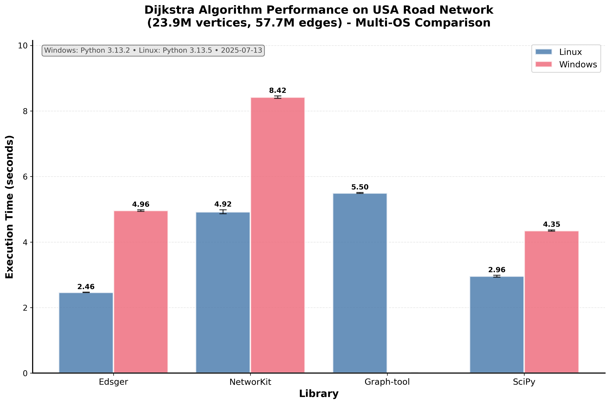

# Edsger

*Directed graph algorithms in Cython*

Welcome to the Edsger documentation! Edsger is a Python library for efficient graph algorithms implemented in Cython. The library focuses on shortest path and network assignment algorithms, featuring Dijkstra's algorithm for positive-weight directed graphs, Bellman-Ford algorithm for directed graphs with negative weights and cycle detection, BFS (Breadth-First Search) for unweighted directed graphs, and the Spiess-Florian hyperpath algorithm for transit network assignment.

## Why Use Edsger?

Edsger is designed to be **dataframe-friendly**, providing seamless integration with pandas workflows for directed graph algorithms. Also it is rather efficient on Linux. Our benchmarks on the USA road network (23.9M vertices, 57.7M edges) demonstrate nice performance:



Note that benchmarks are run on slightly different Intel processors between Linux and Windows.

### Multiple DataFrame Backends Supported

```python
import pandas as pd
import polars as pl
from edsger.path import Dijkstra, BellmanFord, BFS, HyperpathGenerating

# Works with pandas (NumPy backend)
edges_pandas = pd.DataFrame({
    'tail': [0, 0, 1, 2],
    'head': [1, 2, 2, 3],
    'weight': [1.0, 2.0, 1.5, 1.0]
})

# Works with pandas (Arrow backend)
edges_arrow = edges_pandas.astype({
    'tail': pd.ArrowDtype(pa.int64()),
    'head': pd.ArrowDtype(pa.int64()),
    'weight': pd.ArrowDtype(pa.float64())
})

# Works with Polars DataFrames
edges_polars = pl.DataFrame({
    'tail': [0, 0, 1, 2],
    'head': [1, 2, 2, 3],
    'weight': [1.0, 2.0, 1.5, 1.0]
})

# All work seamlessly with the same API!
dijkstra = Dijkstra(edges_polars)  # or edges_pandas or edges_arrow
distances = dijkstra.run(vertex_idx=0)
```

## Key Features

- **Four graph algorithms** - Dijkstra, Bellman-Ford, BFS, and Spiess-Florian hyperpath
- **Multiple DataFrame backends** - Native support for pandas (NumPy & Arrow backends) and Polars
- **High performance** - Cython implementation with optimized memory layout
- **Easy integration** - Works with your existing DataFrame workflows
- **Production ready** - Comprehensive testing across Python 3.10-3.14

## Quick Links

- [Installation](installation.md) - How to install Edsger
- [Quick Start](quickstart.md) - Get started quickly with basic examples
- [API Reference](api.md) - Complete API reference

## Table of Contents

```{toctree}
:maxdepth: 2
:caption: User Guide

installation
quickstart
```

```{toctree}
:maxdepth: 2
:caption: API Reference

api
```

```{toctree}
:maxdepth: 1
:caption: Development

contributing
```

## Indices

- {ref}`genindex`
- {ref}`modindex`
- {ref}`search`

